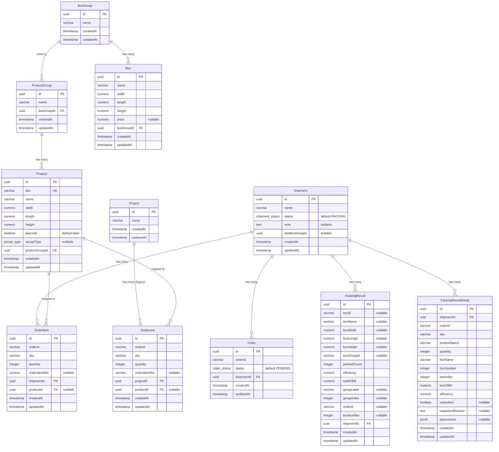

# 데이터베이스 스키마

## ER 다이어그램

## Enum 타입

| Enum | 값 | 용도 |
|------|----|------|
| `order_status` | `PENDING`, `PROCESSING`, `COMPLETED` | 주문 처리 상태 |
| `shipment_status` | `PACKING`, `CONFIRMED` | 출고건 패킹 상태 |
| `aircap_type` | `INDIVIDUAL`, `PER_ORDER`, `BOTH` | 에어캡 유형 (개별/건당/개별+건당) |

## 인덱스

| 테이블 | 타입 | 컬럼 |
|--------|------|------|
| `products` | UNIQUE | `sku` |
| `orders` | UNIQUE | `(shipment_id, order_id)` |
| `order_items` | INDEX | `(shipment_id, product_id)` |
| `order_items` | INDEX | `(shipment_id, order_id)` |
| `outbounds` | INDEX | `(project_id, product_id)` |
| `outbounds` | INDEX | `(project_id, order_id)` |

## 관계 요약

| 부모 | 자식 | 관계 | onDelete |
|------|------|------|----------|
| `ProductGroup` | `Product` | 1:N | CASCADE |
| `BoxGroup` | `ProductGroup` | 1:N | - |
| `BoxGroup` | `Box` | 1:N | CASCADE |
| `Shipment` | `Order` | 1:N | - |
| `Shipment` | `OrderItem` | 1:N | - |
| `Shipment` | `PackingResult` | 1:N | - |
| `Shipment` | `PackingResultDetail` | 1:N | - |
| `Product` | `OrderItem` | 1:N | SET NULL |
| `Project` | `Outbound` | 1:N | - |
| `Product` | `Outbound` | 1:N | SET NULL |
